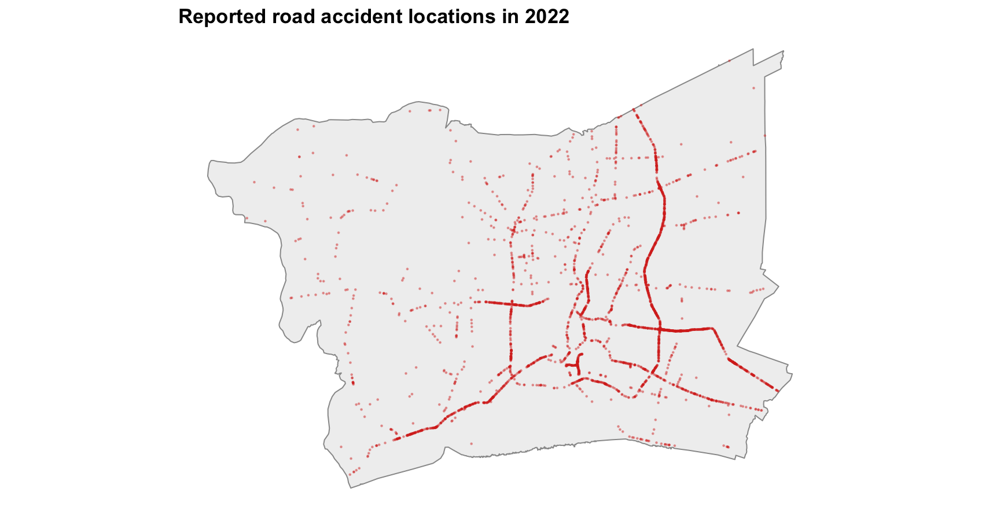
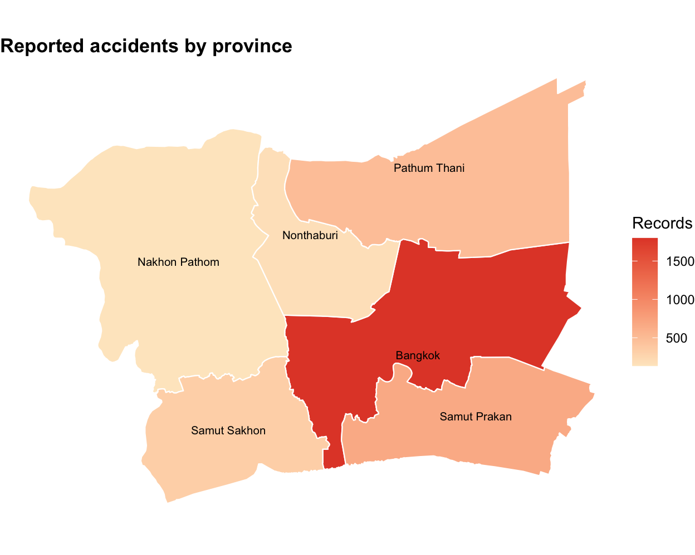
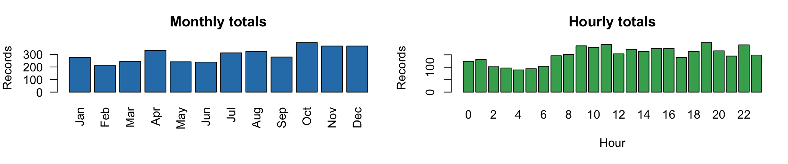
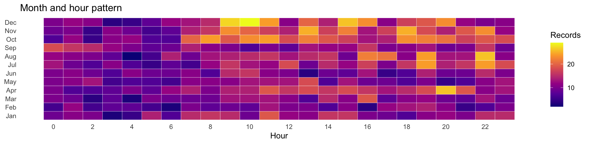
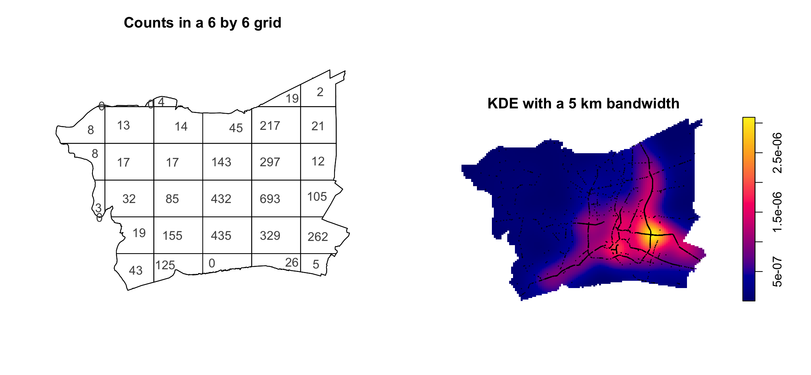
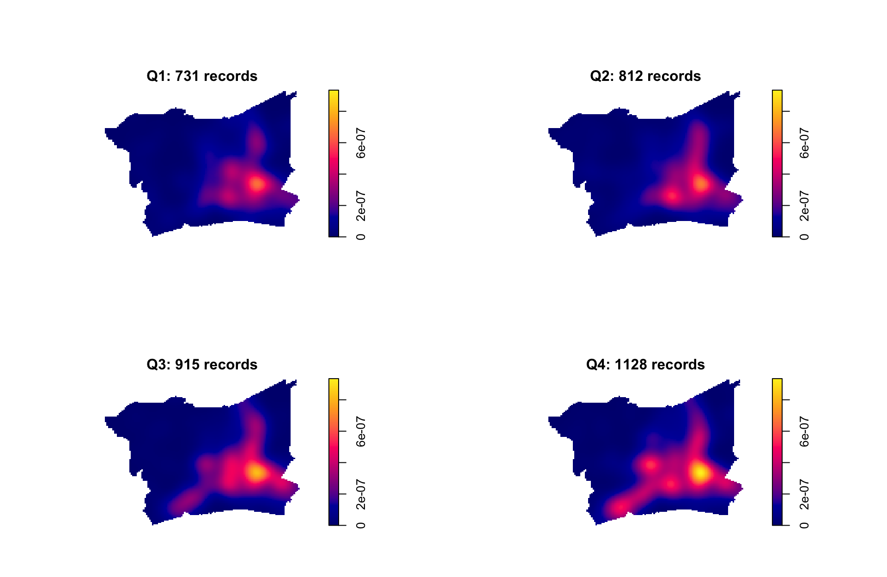
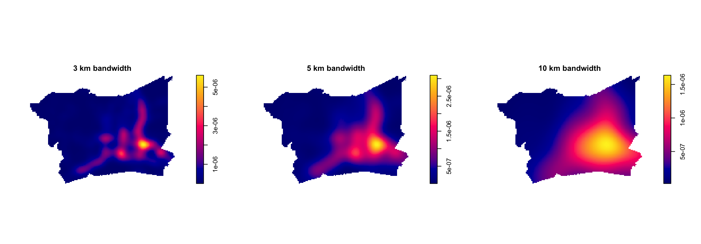
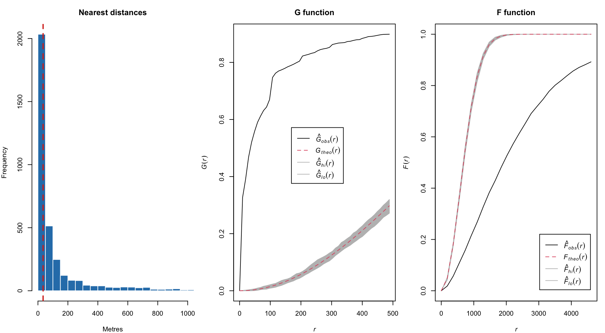
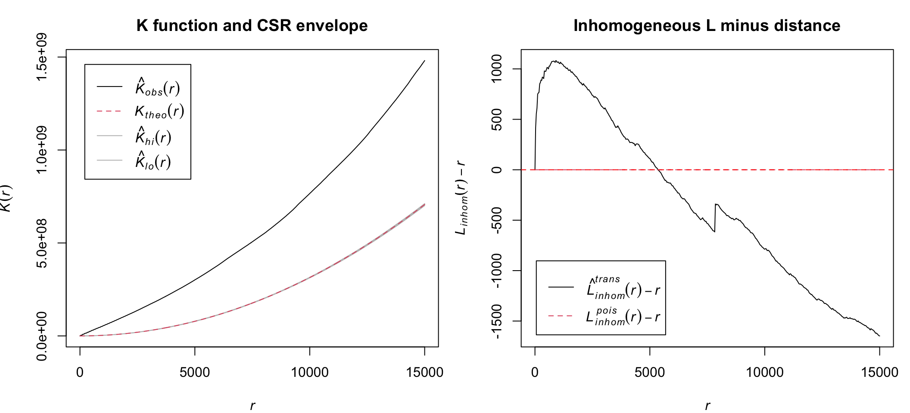
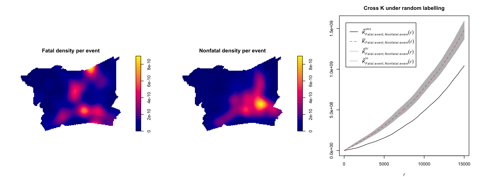

::: cell
:::

## Data and study area

How were reported road traffic accidents distributed across the Bangkok Greater Metropolitan Area in 2022?

The analysis examines event concentration, timing, and interaction between nearby events.

-   Accident records: Thailand Road Accident 2019 to 2022, restricted to 2022
-   Boundary: six ADM1 provinces from geoBoundaries
-   Study window: Bangkok, Samut Prakan, Nonthaburi, Pathum Thani, Samut Sakhon, and Nakhon Pathom
-   Projected CRS: EPSG:32647, with metre based distances

:::: cell
::: cell-output-display
{width="864"}
:::
::::

The raw point map provides a first check of the event locations. It shows more reports in the built up central and eastern part of the study window.

## Data quality and province distribution

::::::::: columns
::::: {.column width="42%"}
:::: cell
::: cell-output-display
| item                     | value |
|:-------------------------|------:|
| Rows in local extract    |  3779 |
| Missing coordinate rows  |   189 |
| Outside study window     |     4 |
| Repeated coordinate rows |   321 |
| Final point events       |  3586 |
:::
::::

Different event IDs with the same coordinates are retained as separate records.
:::::

::::: {.column width="58%"}
:::: cell
::: cell-output-display
{width="624"}
:::
::::
:::::
:::::::::

Bangkok has the largest number of records, followed by Samut Prakan and Pathum Thani. This is a count map, so it should not be read as an exposure adjusted risk map.

## Time pattern across the year and day

:::: cell
::: cell-output-display
{width="1056"}
:::
::::

:::: cell
::: cell-output-display
{width="1056"}
:::
::::

Q4 has the highest total. The largest hourly total is at 19:00, but the heatmap shows several busy periods rather than one isolated hour.

## Quadrat counts and regional density

:::: cell
::: cell-output-display
{width="1056"}
:::
::::

::: cell
:::

The grid shows the raw count contrast, while KDE shows the smoothed pattern. The quadrat Monte Carlo p value is 0.005, supporting a nonuniform intensity.

## Quarterly spatial pattern

:::: cell
::: cell-output-display
{width="960"}
:::
::::

The broad central and eastern concentration persists in all four quarters. Counts rise from 731 in Q1 to 1,128 in Q4, and the surface becomes stronger in the second half of the year.

## KDE bandwidth sensitivity

:::: cell
::: cell-output-display
{width="1152"}
:::
::::

The 3 km map shows smaller local peaks. The 10 km map smooths them into a broad regional pattern. The central and eastern concentration remains visible in all three maps, so the broad conclusion does not depend on one bandwidth.

## Nearest neighbour evidence

:::: cell
::: cell-output-display
{width="960"}
:::
::::

The median nearest neighbour distance is about 34 m. Clark Evans R is about 0.26, the G curve is high, and the F curve is low relative to CSR. All three results support short distance clustering.

## K function and trend sensitivity

:::: cell
::: cell-output-display
{width="1056"}
:::
::::

K is above the homogeneous CSR envelope. After allowing for the broad 5 km intensity trend, residual clustering is strongest below about 5 km. Coordinate jitter gives R values from 0.264 to 0.295, still far below 1.

## Fatal and nonfatal spatial patterns

:::: cell
::: cell-output-display
{width="1152"}
:::
::::

Both event types share a broad urban pattern. Yet the observed Cross K is below the random labelling envelope. With locations fixed, fatal events have fewer nearby nonfatal neighbours than expected from random labels.

## Main findings and planning use

:::: cell
::: cell-output-display
| analysis | result | implication |
|:---|:---|:---|
| First order | Quadrats and KDE show a persistent central and eastern concentration | Review corridors and junctions in the broad concentration area |
| Time | Q4 has 1,128 records compared with 731 in Q1 | Compare busy periods with traffic flow, holidays, weather, and road works |
| Interaction | Residual clustering is strongest below about 5 km | Prioritise local corridor checks instead of one large regional hotspot claim |
| Fatal labels | Fatal labels show spatial separation under random labelling | Study road class and speed conditions before explaining fatal outcomes |
| Data limit | No traffic exposure or road network denominator is available | Do not rank provinces as more dangerous from event counts alone |
:::
::::

Use the results for screening, not direct risk ranking. The next step is to connect events to road segments and add traffic exposure.

Data: [Thailand Road Accident 2019 to 2022](https://www.kaggle.com/datasets/thaweewatboy/thailand-road-accident-2019-2022), [geoBoundaries](https://www.geoboundaries.org/). Methods: Gimond (2018), Lovelace et al. (2024), Pebesma and Bivand (2025).

Ziying Zhou
